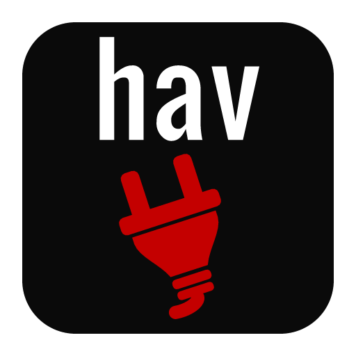

  

<h1 align="center">havRemote</h1>

  A native desktop client for browsing and transferring files between your
  computer and remote systems.

  <a href="https://github.com/Havoc7891/havRemote/releases">Downloads</a> &middot;
  <a href="#getting-started">Getting started</a> &middot;
  <a href="https://havoc.de">Website</a>

Manage remote files with side-by-side local and remote browsers, separate
connection tabs, and a transfer queue that keeps track of your work.

## Contents

- [Features](#features)
- [Download](#download)
- [Getting started](#getting-started)
- [Help and support](#help-and-support)
- [Security and privacy](#security-and-privacy)
- [Build from source](#build-from-source)
- [Contributing](#contributing)
- [License](#license)

## Features

- **FTP, FTPS, and SFTP:** Explicit and implicit FTPS, plus active and passive FTP.
- **Connection tabs:** A separate local and remote file browser for every connection.
- **Saved sites:** Organize connections in folders, duplicate sites or folders, and import or export profiles.
- **File browsing:** Sortable file lists, context menus, and drag-and-drop transfers.
- **Transfer queue:** Upload and download files and folders with progress, speed, time estimates, and conflict handling.
- **Transfer recovery:** Pause, cancel, retry, resume where supported, and recover unfinished work after restarting.
- **File management:** Create remote files and folders, rename or delete items, and change remote permissions.
- **External editing:** Edit local and remote files in your preferred editor.
- **SFTP authentication:** Passwords, private keys, SSH agents, and keyboard-interactive prompts, including two-step sign-in.
- **Transfer reports:** Copy transfer details or export them as CSV.
- **Personalization:** Light and dark themes, an English or German interface, and remembered window and browser layouts.

## Download

Find available downloads on [GitHub Releases](https://github.com/Havoc7891/havRemote/releases).

- **Windows 10/11 (x64):** Download the application ZIP, extract the entire
  archive, and open `havRemote.exe`. Keep all included files together.
- **Linux:** See the [Linux build guide](docs/building.md#linux-desktop-build).
- **macOS:** Source support is present, but has not yet been tested on a native
  macOS system.

The Windows package requires no installation. Settings and transfer recovery
data are stored in your user profile, not in the extracted folder.

> [!IMPORTANT]
> Before updating, close havRemote and back up your
> [application data](docs/configuration.md#files-and-storage-locations).
> Settings and saved transfer state may not be compatible between pre-1.0 versions.

Automatic update checks are enabled by default and can be disabled in Settings.
You can also choose **Help → Check for Updates**. Downloads open in your browser.
havRemote does not install updates automatically.

## Getting started

1. Enter your server's protocol, host, port, username, and password in
   **Quick Connect**, then select **Connect**.
2. Choose the local folder on the left and the remote folder on the right.
3. Drag files or folders between the panes to upload or download them.
4. Follow progress in **Queue**, and check **Failed** or **Completed** for results.

Use **Site Manager** to save connections or choose another SFTP authentication
method. Quick Connect uses password authentication and passive mode for FTP
and FTPS. Prefer SFTP or FTPS when your server supports it, as plain FTP sends
credentials and files without encryption.

## Help and support

Press `F1` or choose **Help → View Help** for the included offline guide,
available in English and German. It covers connections, file operations,
transfer recovery, and keyboard shortcuts.

For data locations and advanced options, see the
[configuration reference](docs/configuration.md).

Report bugs or suggest features through
[GitHub Issues](https://github.com/Havoc7891/havRemote/issues).
Include your havRemote version, operating system, and steps to reproduce the
problem. Remove passwords and private information from logs and screenshots
before sharing them.

## Security and privacy

Saved passwords and key passphrases use your operating system's secure
credential store. They are never written to settings files or Quick Connect
history. FTPS certificates and SFTP server keys are verified when connecting.

Update checks contact GitHub, which receives normal connection information
such as your public IP address. No GitHub account is needed.

## Build from source

See [Building havRemote](docs/building.md) for toolchains, dependencies, build
instructions, debugging, and tests. There are separate guides for
[protocol integration tests](tests/integration/README.md) and
[release packaging](docs/releasing.md).

## Contributing

Suggestions for features and bug reports are welcome via issues.

Pull requests are accepted for localization updates. Other changes are
implemented by the maintainer.

Localization pull requests may add or update CSON catalogs in
[`translations`](translations).
[Catalogs](docs/configuration.md#localization-catalogs) must use the same keys and
compatible placeholders as `en.cson`. Run the complete test suite before submitting an
update.

## License

Copyright © 2026 René Nicolaus

havRemote is available under the [MIT License](LICENSE). Third-party components
retain their own licenses. See [Third-party notices](thirdPartyNotices.md).

The following acknowledgments concern code included through LibreSSL:

This product includes software developed by the OpenSSL Project
for use in the OpenSSL Toolkit. (http://www.openssl.org)

This product includes cryptographic software written by Eric Young
(eay@cryptsoft.com).
